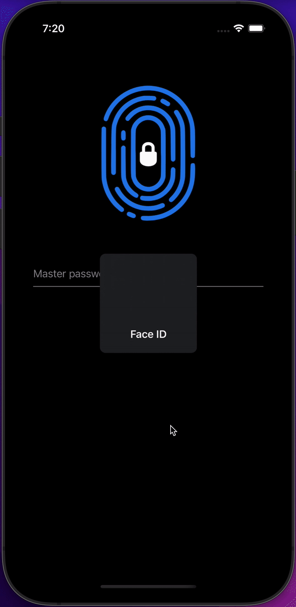
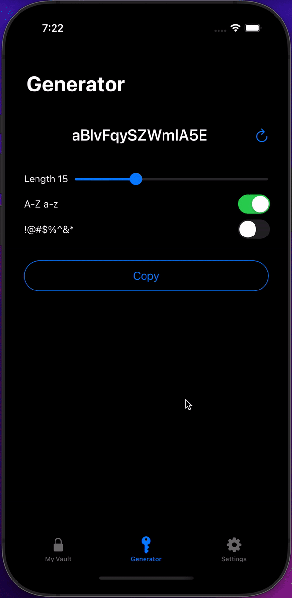
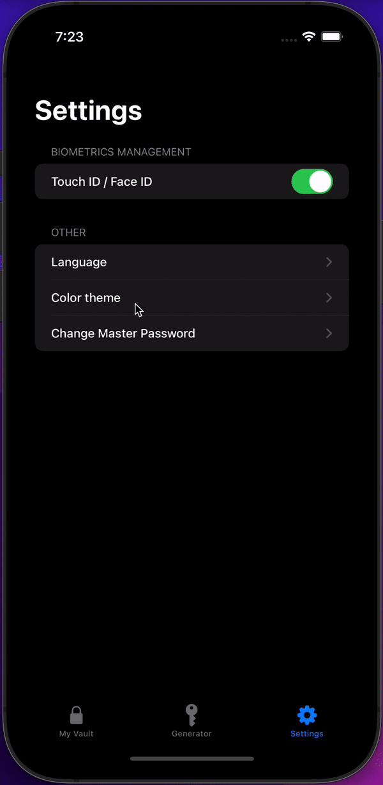

# Key Keeper

[](https://github.com/vssavosko/key-keeper/blob/main/LICENSE)
[](https://swift.org)

An iOS application for storing logins and passwords from accounts

<div style="display: flex; justify-content: space-between;">
  
  
  
</div>

## How to build

1) Clone the repository

```bash
$ git clone git@github.com:vssavosko/key-keeper.git
```

2) Install pods

```bash
$ cd KeyKeeper
$ pod install
```

3) Open the workspace in Xcode

```bash
$ open "KeyKeeper.xcworkspace"
```

## Compatibility

This project is written in Swift 5.0 and requires Xcode 10.2 or newer to build and run.

The project is compatible with iOS 13.0+.

## License

Licensed under MIT License: https://opensource.org/licenses/MIT
